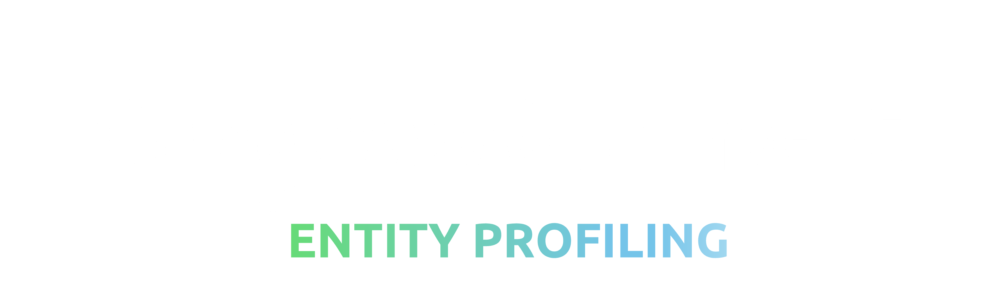

# Entity Extraction & Profiling in Unstructured Text
This application has been developed to demonstrate the art of the possible relating to analysis of unstructured data and in particular identifying subjects (entities) of interest within text.

The application consists (at present) of a set of utilities to parse and analyse unstructured text:

* Identify individuals, organisations and other entities within text
* Identify specific subjects of interest within text.

The served version of the application is here:.

https://entity-resolution.azurewebsites.net/


## ✨ **Who its for** 
The application was developed for policing and national security organisations but can easily be generalise to any domain with the requirement of identifying individiuals within free text.

## ✨ **Setup and running the application** 

#### Running locally

To run the app locally just install the dependencies (requirements.txt) in a venv and run:

```bash
$ cd er_app/
$ streamlit run app.py
```

#### Deployment to a served web app

The app is deployed in the 'aaiapplications' resource group on the A&AI Azure subscription. The steps are:

1. Build the image locally 

```bash
$ docker build -t entity-resolution:latest .
```

2. Log into the A&AI applications Azure Container Registry

```bash
$ az acr login -n aaiapplications
```

3. Tag the local image to a remote image

```bash
$ docker tag entity-resolution:latest aaiapplications.azurecr.io/entity-resolution:latest
```

4. Push the remote image to the ACR

```bash
$ docker push aaiapplications.azurecr.io/entity-resolution:latest
```

The application supports CI/CD and will redeploy when a new image is detected in the registry.

## ✨ Info and contact

Developed by ian.b.davies@capgemini.com and louise.john@capgemini.com - email for more info or any with questions.
